# Gamer Insight

Gamer Insight is your go-to destination for all things gaming. Dive into a vibrant community where you can discover new games, share insights, and connect with fellow gamers. Explore the latest releases, insightful reviews, and engaging discussions to level up your gaming experience. Bookmark your favorite content and stay organized in your gaming pursuits. Join Gamer Insight and unlock a world where passion meets play.

Live link - [Gamer Insight](https://gamerinsight-3420a19788ac.herokuapp.com/)

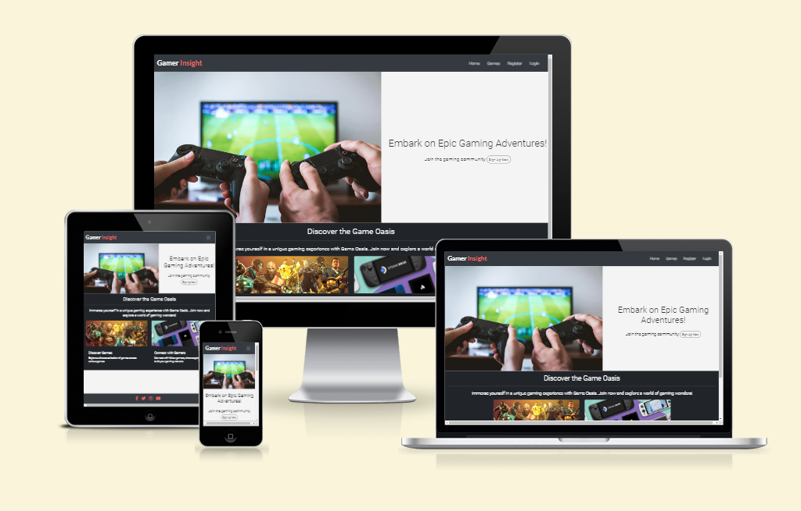

## User Experience (UX)

### Agile

### User Stories

#### USER STORY: Dive into Game Details
- As a guest user, I can click on a game to view its details and learn more about a specific game.

#### USER STORY: Explore the Game Library
- As a guest user, I can view a list of available games on the homepage to explore the game options.

#### USER STORY: Expand the Game Library
- As an admin user, I can add new games to the platform to keep the game library updated.

#### USER STORY: Secure Account Access
- As a registered user, I can log in and log out of my account to access personalized features and ensure the security of my account.

#### USER STORY: Seamlessly Experience Across Devices
- As a user, I can use the website on different devices for a seamless experience regardless of my device.

#### USER STORY: Trustworthy Platform Security
- As a user, I can trust that my personal information is secure to use the platform without concerns about privacy.

#### USER STORY: Manage My Contributions
- As a registered user, I can edit my own reviews to provide updated information.

#### USER STORY: Maintain Review Standards
- As an admin user, I can moderate user reviews to ensure the platform's content meets community standards.

### Not Implemented User Stories

#### USER STORY: Personalized Recommendations
- As a registered user, I can receive personalized game recommendations based on my previous reviews and preferences.

#### USER STORY: Engage in Community Discussions
- As a user, I can actively participate in community discussions, sharing insights and engaging with other users on diverse gaming topics, fostering a sense of community within the platform. 

#### USER STORY: Stay Informed and Connected
- As a user, I can receive feedback and notifications for my actions to stay informed about the outcomes of my interactions with the platform. **PS: Although there isn't a specific section for these discussions, users can interact using the comment section for each game.**

You can have access to the full Project page [here](https://github.com/users/ruimarnjr/projects/5).

##  Design

### Colour Scheme

#### Background Color (#e0e0e0):
- Description: A light gray background (#e0e0e0) creates a clean and neutral canvas, allowing the content to stand out while maintaining a modern and inviting feel.

#### Main Text Color (#444):
- Description: Dark gray text (#444) ensures readability against the light background, providing a sharp and clear visual presentation for the website's content.

#### Accent Color (#FF6666):
- Description: The bold coral red (#FF6666) serves as an attention-grabbing accent color, perfect for buttons and links. It injects energy and excitement, guiding users to interact with key elements on the Gamer Insight website.

### Imagery

### Image 1: Video Game Controllers
- Description: Immerse yourself in the world of gaming with our curated selection of video game controllers. Two controllers, poised for action, symbolize the thrilling gaming experiences awaiting you. Feel the pulse of every game as you explore new realms and conquer challenges.

### Image 2: Discover New Games
- Description: Uncover a treasure trove of gaming possibilities with our collection of diverse games. A set of game covers sprawled beneath the enticing title "Discover New Games" invites you to explore and expand your gaming horizons. From epic adventures to hidden gems, there's always something new to discover. Additionally, users can contribute to this gallery by uploading images of their favorite games, ensuring a dynamic and ever-growing collection.

### Image 3: Connect with Gamers
- Description: Forge connections and build lasting friendships within the gaming community. A set of pocket-sized video games accompanies the title "Connect with Gamers," emphasizing the social aspect of gaming. Engage in discussions, share strategies, and make meaningful connections with fellow gamers who share your passion. User-contributed images showcasing their gaming experiences further enhance the sense of community and shared enthusiasm.

These descriptions highlight not only the existing imagery on the Gamer Insight platform but also the collaborative nature of the community, where users can actively contribute to the visual richness of the website by uploading images of their favorite games.

### Fonts
- The choice of the Roboto font for Gamer Insight serves to enhance the overall user experience by offering a clean, modern, and highly readable typeface. Roboto's sleek design and well-defined letterforms contribute to a visually appealing and professional aesthetic. Its versatility ensures clarity in conveying information, making it an ideal choice for presenting gaming content, reviews, and discussions on the platform. Roboto's balanced and neutral characteristics create a harmonious visual environment, allowing users to focus on the immersive gaming content and community engagement without distraction.

### Database Schema

### Game Model

 #### The Game model represents a video game on the Gamer Insight platform. It includes the following fields:

**title**: The title of the game.

**featured_image**: The featured image of the game, stored using CloudinaryField with a default placeholder.

**author**: A foreign key to the User model, indicating the author or contributor of the game.

**review**: A field to store the game review, utilizing SummernoteTextField for rich text content.

**created_on**: The date and time when the game entry was created.

**status**: An integer field with choices reflecting the status of the game (e.g., Released, In Development).
genre: The genre of the game.

**platform_played**: The gaming platform on which the game is played.

**developer**: The developer or development studio responsible for the game.
Additionally, methods like get_absolute_url and __str__ have been implemented for ease of use and representation.

### Comment Model

#### The Comment model represents user comments on a specific game. It includes the following fields:

**game**: A foreign key to the Game model, establishing a connection to the game being commented on.

**name**: The name of the commenter.

**email**: The email of the commenter.

**body**: The text content of the comment.

**created_on**: The date and time when the comment was created.

### GameCollectionItem Model

#### The GameCollectionItem model represents a user's interaction with a game, indicating whether they are playing, have the game queued, completed it, are interested, or have abandoned it. It includes the following fields:

**user**: A foreign key to the User model, linking the collection item to a specific user.

**game**: A foreign key to the Game model, linking the collection item to a specific game.

**stage**: An integer field with choices reflecting different stages of interaction with the game (e.g., Playing, Queued, Completed).

This model enables users to organize and track their gaming experiences within their collection, providing valuable insights into their gaming preferences and activities.

## Features

### Header 
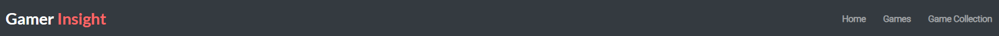

### Nav Bar 
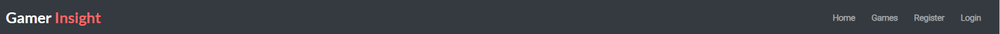

The navigation bar, styled with a dark theme, showcases the Gamer Insight brand. It features a prominent logo, "Gamer Insight," with a playful touch, and a responsive collapsible menu for seamless navigation. The menu items include "Home," "Games," and, for authenticated users, "Game Collection" and "Logout." For non-authenticated users, options to "Register" and "Login" are provided. This well-organized navigation bar ensures an intuitive and visually appealing experience, allowing users to effortlessly explore the Gamer Insight platform.

### Home Page

The home page hero section features a captivating gaming image alongside a personalized welcome for authenticated users. The layout is clean and inviting, with a greeting to the logged-in user and an encouraging lead text to explore new games and challenges. The design aims to create an engaging and dynamic introduction to the Gamer Insight platform.

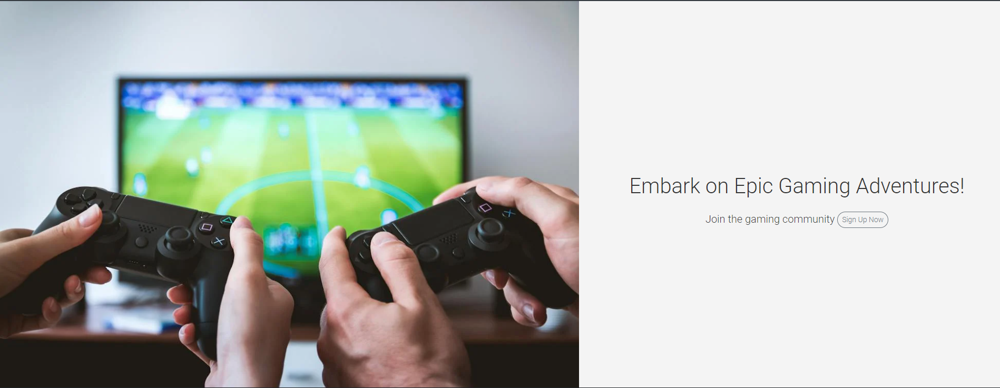

### Discover The Game Oasis

#### Discover Games:

- Image: A visually appealing card featuring a background cover of diverse games, enticing users to explore.

- Title: "Discover Games" is prominently displayed, emphasizing the platform's extensive game collection.

- Description: A brief description encourages users to explore a diverse range of games across various genres.

#### Connect with Gamers:

- Image: Another captivating card featuring a background cover that illustrates the social aspect of gaming.

- Title: "Connect with Gamers" is highlighted, signaling the importance of community and shared experiences.

- Description: Users are encouraged to connect with fellow gamers, share experiences, and build their gaming network.

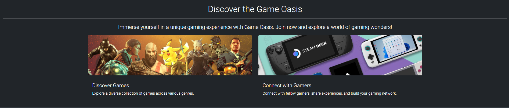

### Footer

The footer section features clickable social media icons that link to Gamer Insight's pages on Facebook, Twitter, Instagram, and YouTube. Styled with a margin and padding for a clean look, these icons provide users with quick access to the platform's social media presence.

### Signup Page

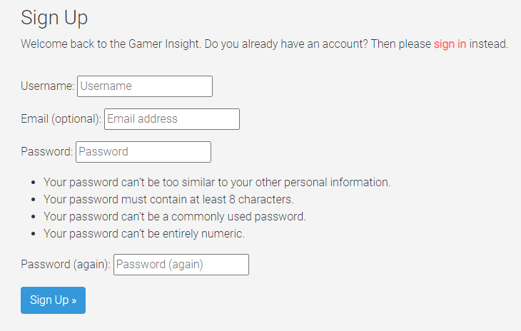

This template represents the "Sign Up" page for Gamer Insight. It includes a form for users to create a new account, with a welcome message encouraging users to sign up. If users already have an account, there's a link to the sign-in page.

### Login Page

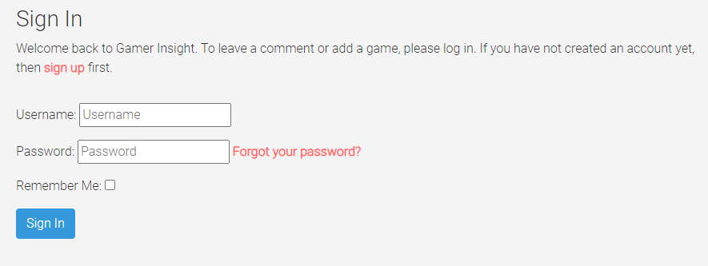

This template represents the "Sign In" page for Gamer Insight. It includes a form for users to log in, along with a welcome message encouraging users to sign in to leave comments or add games. If users don't have an account, there's a link to the sign-up page.

### Logout Page

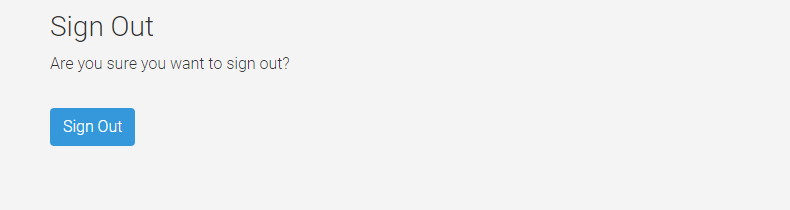

This template represents the "Sign Out" page for Gamer Insight. It includes a confirmation message asking users if they are sure they want to sign out. Users can then proceed to sign out by submitting the form.

### Games

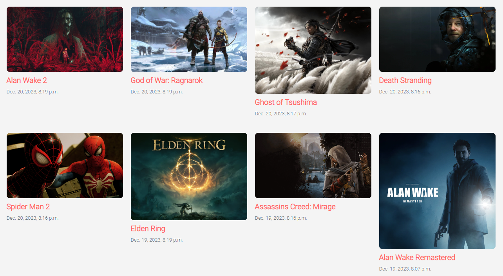

This page showcases all games with a status of "published," presenting the most recent games first. The game cards are paginated after every 8 games.

Each card features the game's image, title, and genre. Clicking anywhere inside the game card will directly navigate users to the detailed page for that specific game.

This design ensures a user-friendly browsing experience, allowing users to effortlessly explore and discover the latest published games on the Gamer Insight platform. The pagination feature helps manage content and enhances navigation convenience for users exploring a diverse collection of games.

### Add Game Form Section

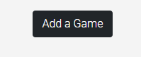

#### Authenticated User Check: 
- It checks if the user is authenticated. If so, it proceeds to display the add game form.

#### Form Display:

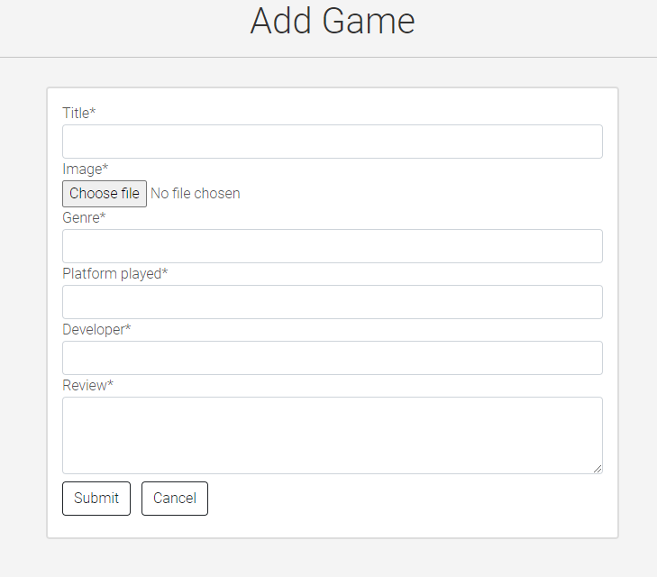

- The form is displayed within a card, providing a clean and organized layout.
- The form includes fields for game details, and  is used to render the form with a more user-friendly interface.
- The form includes a file input for uploading a game's featured image.

#### Form Submission:
- The form is submitted via POST request with the enctype="multipart/form-data" attribute, indicating it can handle file uploads.
- CSRF token is included for security.
- "Submit" and "Cancel" buttons are provided for form submission and canceling the addition of a new game, respectively.

### Game Detail

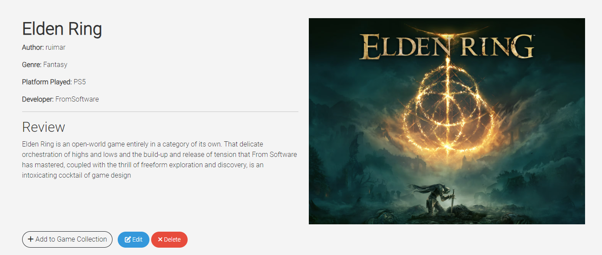

### Game Details Section

#### Title and Information:

 - The left column (col-details) provides essential details about the game, including its title, author, genre, platform played, and developer.

 - A horizontal rule (hr) separates the general information from the review section.

- Review: The review section displays the game's review content. 

- The |safe filter is used to render HTML content safely.

- Featured Image: The right column displays the featured image of the game. If the image is not available, a default placeholder image is used.
Action Buttons Section

### Edit Game Form Section

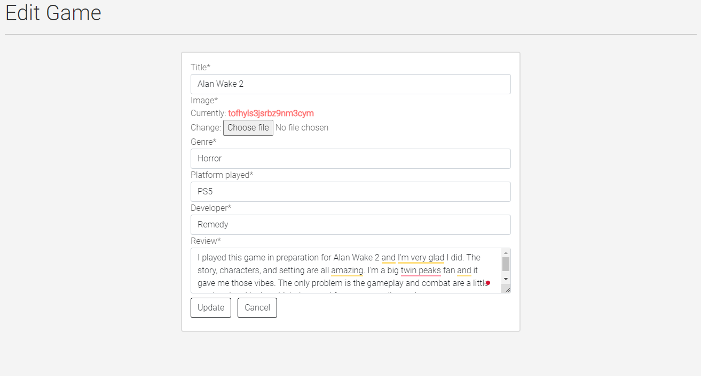

This section represents the "Edit Game" page on the Gamer Insight website. It includes a title, a horizontal rule for visual separation, and an edit game form. The form is displayed within a card, allowing users to update game details such as title, genre, and featured image. The form submission is handled via a POST request with support for file uploads. If the user is authenticated and owns the game, they can update the game details by clicking the "Update" button. A "Cancel" button is provided to return to the detailed view of the current game. This design ensures a user-friendly experience for updating game information.

### Delete Game Form Section

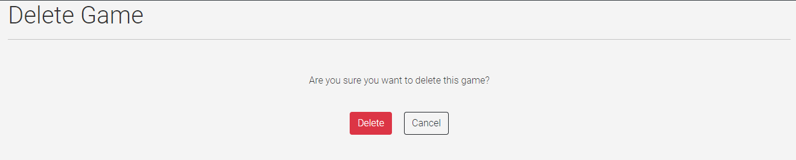

This section represents the "Delete Game" page on the Gamer Insight website. It includes a title, a horizontal rule for visual separation, and a confirmation message asking the user if they are sure they want to delete the game. The delete game form is displayed with two buttons: "Delete" and "Cancel." The "Delete" button triggers the deletion of the game, while the "Cancel" button allows users to navigate back to the detailed view of the current game. This design ensures a straightforward and user-friendly experience for confirming or canceling the deletion of a game.

#### Add to Game Collection Button:

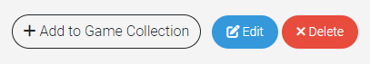

 - If the user is authenticated, an "Add to Game Collection" button is displayed. Clicking this button triggers a modal to select the game's stage in the user's collection.

- Edit and Delete Buttons: If the user is both authenticated and the author of the game, "Edit" and "Delete" buttons are displayed. These buttons lead to pages for editing or deleting the game.

#### Game Collection Modal
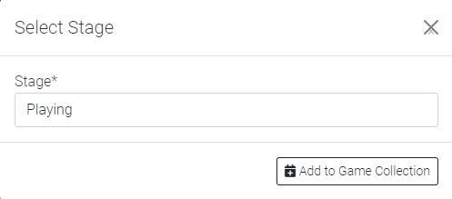

- Stage Selection: The modal provides a form to select the stage for adding the game to the user's game collection.
Form Submission:

- The form is submitted to the 'game_detail' view with the game's primary key (pk) as part of the action URL.

### Comment Form Section

#### Authenticated User Check:

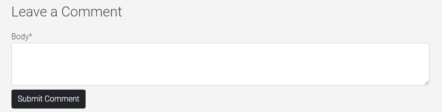

- The section checks if the user is authenticated. If so, it displays a comment form.
- If the user is not authenticated, a message prompts them to log in to leave a comment.

#### Leave a Comment Form:

- If authenticated, a form is presented for users to leave comments.
- The form includes fields for the user's name and the comment itself.
- The form is submitted via POST request, and the CSRF token is included for security.
- A "Submit Comment" button allows users to submit their comments.

### Comment Display Section

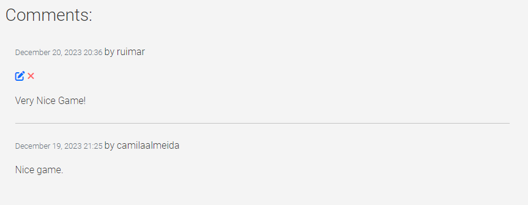

#### Comments Heading:

- A heading "Comments:" is displayed to introduce the section.
Displaying Comments:

- Comments are displayed using a loop through the comments data.
Each comment includes information such as the comment's creation date, commenter's name, and the comment body.

- For authenticated users, an option to edit or delete their own comments is provided.

- If there are multiple comments, a horizontal rule is used to separate them.

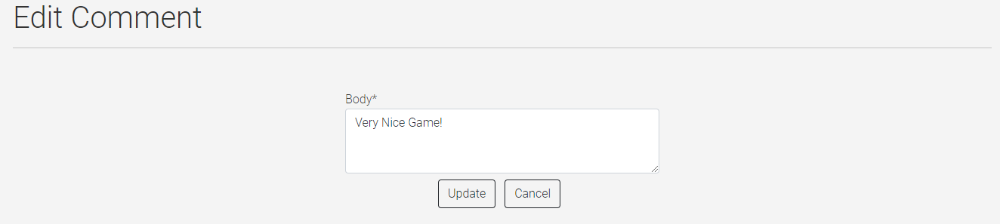

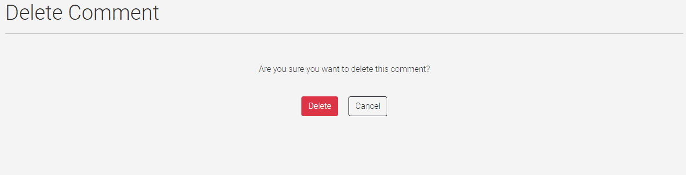

### Game Collection Cards Section

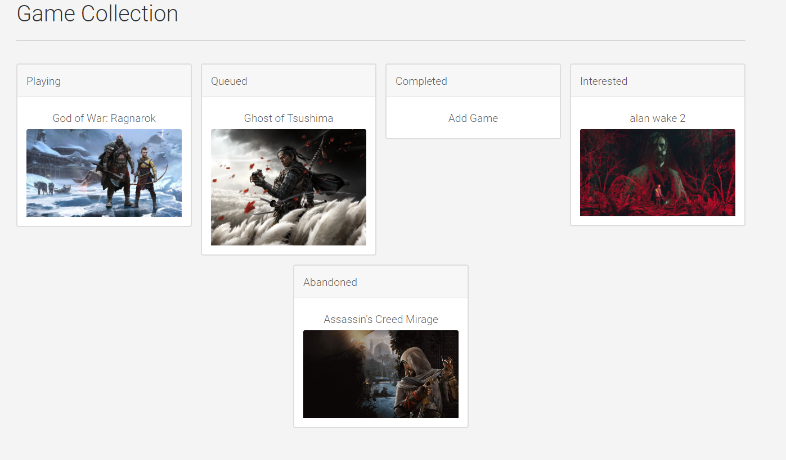

#### Responsive Grid: 
- Game collection cards are presented in a responsive grid layout.

#### Card Header:
- Each card includes a header with the stage name.

#### Card Body:

- The card body contains details about the game for the respective stage.
- If a game exists for the stage, its title and featured image are displayed along with a link to the detailed view of the game.
- If no game exists for the stage, a placeholder message ("Add Game") is displayed, along with a link to the general games page.
- This design provides users with an organized and visually pleasing representation of their game collection. Users can easily navigate to the detailed view of each game or add new games to their collection.

### Error Pages

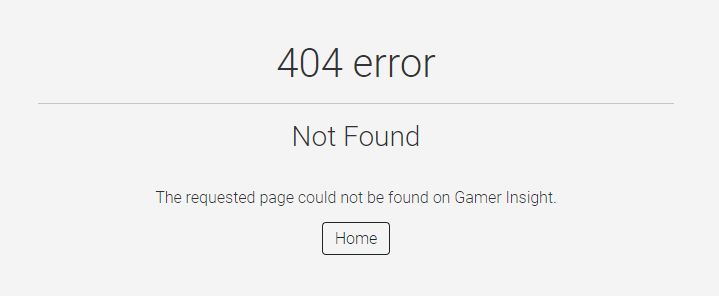

#### 404 Error:
- Page not found. The requested page could not be located on the server.

#### 400 Error:
- Bad Request. The server could not understand the request due to invalid syntax.

#### 403 Error:
- Forbidden. Access to the requested resource is not allowed.

#### 500 Error:
- Internal Server Error. The server encountered an unexpected condition, preventing it from fulfilling the request.

## Deployment - Heroku

To deploy this page to Heroku from its GitHub repository, the following steps were taken:

### Create the Heroku App:
- Log in to [Heroku](https://dashboard.heroku.com/apps) or create an account.
- On the main page click the button labelled New in the top right corner and from the drop-down menu select "Create New App".
- Enter a unique and meaningful app name.
- Next select your region.
- Click on the Create App button.

### Attach the Postgres database:
- In the Resources tab, under add-ons, type in Postgres and select the Heroku Postgres option.
- Copy the DATABASE_URL located in Config Vars in the Settings Tab.

### Prepare the environment and settings.py file:
- In your GitPod workspace, create an env.py file in the main directory.
- Add the DATABASE_URL value and your chosen SECRET_KEY value to the env.py file. 
- Update the settings.py file to import the env.py file and add the SECRETKEY and DATABASE_URL file paths.
- Comment out the default database configuration.
- Save files and make migrations.
- Add Cloudinary URL to env.py
- Add the cloudinary libraries to the list of installed apps.
- Add the STATIC files settings - the url, storage path, directory path, root path, media url and default file storage path.
- Link the file to the templates directory in Heroku.
- Change the templates directory to TEMPLATES_DIR
- Add Heroku to the ALLOWED_HOSTS list the format ['app_name.heroku.com', 'localhost']

### Create files / directories
- Create requirements.txt file
- Create three directories in the main directory; media, storage and templates.
- Create a file named "Procfile" in the main directory and add the following: web: gunicorn project-name.wsgi

### Update Heroku Config Vars
Add the following Config Vars in Heroku:
- SECRET_KEY value 
- CLOUDINARY_URL
- PORT = 8000
- DISABLE_COLLECTSTATIC = 1

### Deploy
- NB: Ensure in Django settings, DEBUG is False
- Go to the deploy tab on Heroku and connect to GitHub, then to the required repository. 
- Scroll to the bottom of the deploy page and either click Enable Automatic Deploys for automatic deploys or Deploy Branch to deploy manually. Manually deployed branches will need re-deploying each time the repo is updated.
- Click View to view the deployed site.

The site is now live and operational.
## Forking this repository
- Locate the repository at this link [GamerInsight](https://github.com/ruimarnjr/gamerinsight).
- At the top of the repository, on the right side of the page, select "Fork" from the buttons available. 
- A copy of the repository is now created.

## Cloning this repository
To clone this repository follow the below steps: 

1. Locate the repository at this link [Gamer Insight](https://github.com/ruimarnjr/gamerinsight). 
2. Under **'Code'**, see the different cloning options, HTTPS, SSH, and GitHub CLI. Click the prefered cloning option, and then copy the link provided. 
3. Open **Terminal**.
4. In Terminal, change the current working directory to the desired location of the cloned directory.
5. Type **'git clone'**, and then paste the URL copied from GitHub earlier. 
6. Type **'Enter'** to create the local clone. 

## Languages

- Python
- HTML
- CSS
- Javascript

## Frameworks - Libraries - Programs Used
- [Django](https://www.djangoproject.com/): Main python framework used in the development of this project
- [Django-allauth](https://django-allauth.readthedocs.io/en/latest/installation.html): authentication library used to create the user accounts
- [PostgreSQL](https://www.postgresql.org/) was used as the database for this project.
- [Heroku](https://dashboard.heroku.com/login) - was used as the cloud based platform to deploy the site on.
- [Chrome Dev Tools](https://developer.chrome.com/docs/devtools/) - Used for overall development and tweaking, including testing responsiveness and performance.
- [GitHub](https://github.com/) - Used for version control and agile tool.
- [Google Fonts](https://fonts.google.com/) - Used to import and alter fonts on the page.
- [W3C](https://www.w3.org/) - Used for HTML & CSS Validation.
- [PEP8 Online](http://pep8online.com/) - used to validate all the Python code
- [Jshint](https://jshint.com/) - used to validate javascript
- [Favicon](https://favicon.io/) - Used to create the favicon.
- [Summernote](https://summernote.org/): A WYSIWYG editor to allow users to edit their posts
- [Crispy Forms](https://django-crispy-forms.readthedocs.io/en/latest/) used to manage Django Forms
- [Cloudinary](https://cloudinary.com/): the image hosting service used to upload images
- [Bootstrap 5.0.1](https://blog.getbootstrap.com/2021/05/13/bootstrap-5-0-1/): CSS Framework for developing responsiveness and styling

## Credits

- [W3Schools](https://www.w3schools.com/)
- [Stack Overflow](https://stackoverflow.com/)
- Images: [Pexels](https://www.pexels.com/), [Ign Games](https://www.ign.com/ie), [Retrododo](https://retrododo.com/)
- [Pagination](https://simpleisbetterthancomplex.com/tutorial/2016/08/03/how-to-paginate-with-django.html)
- [Code Institute - Blog Walkthrough Project](https://github.com/Code-Institute-Solutions/Django3blog)
- [Alison O'Keeffe - PP4_My_Meal_Planner](https://github.com/AliOKeeffe/PP4_My_Meal_Planner) Some of the key codes for the Gamer Insight were taken and adapted from this project.

