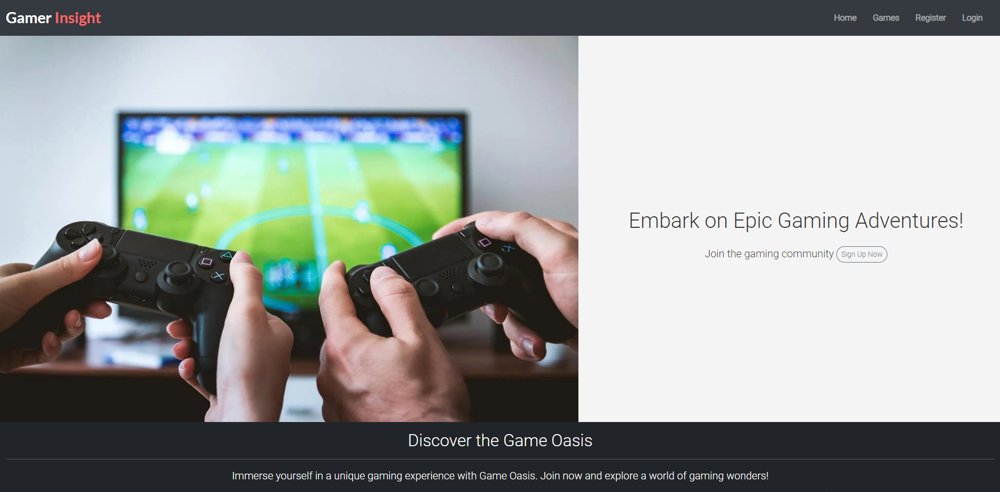
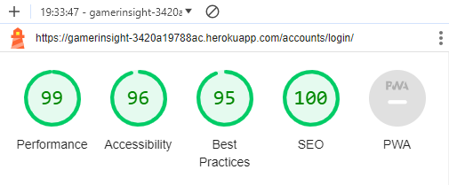
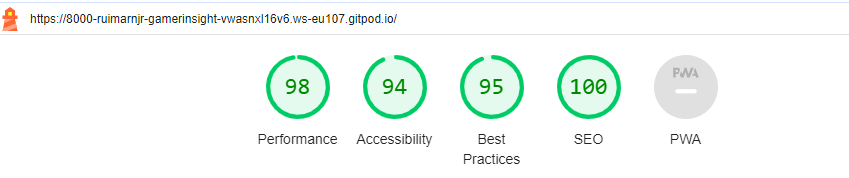

# Table of Contents
- [User Story Testing](#user-story-testing)
- [Validators](#validators)
  * [HTML](#html)
  * [CSS](#css)
  * [Javascript](#javascript)
  * [Python](#python)
  * [Lighthouse](#lighthouse)
- [Browser Compatibility Testing Summary](#browser-compatibility-testing-summary)
- [Manual Testing](#manual-testing)
  * [Site Navigation](#site-navigation)
  * [Home Page](#home-page)
  * [Games Page](#games-page)
  * [Game Detail Page](#game-detail-page)
  * [Add Game Page](#add-game-page)
  * [Update Game Page](#update-game-page)
  * [Confirm Delete Game Page](#confirm-delete-game-page)
  * [Game Collection Page](#game-collection-page)
  * [Django All Auth Pages](#django-all-auth-pages)
- [Bugs](#bugs)
  * [Fixed Bugs](#fixed-bugs)
    + [Bootstrap Styling Conflicts](#bootstrap-styling-conflicts)
    + [Django Template Rendering Errors](#django-template-rendering-errors)
    + [Django Form Validation Problems](#django-form-validation-problems)
    + [Django Static Files Configuration](#django-static-files-configuration)
    + [Django Model Form Issues](#django-model-form-issues)
    + [Django Database Connection Problems](#django-database-connection-problems)
    
    
  * [Unfixed bugs:](#unfixed-bugs)

## User Story Testing

### USER STORY: Dive into Game Details

- As a guest user, I can click on a game to view its details and learn more about a specific game.

This game details page provides guest users with comprehensive information to make informed decisions about the game and fosters engagement with the gaming community.

### USER STORY: Explore the Game Library

- As a guest user, I can view a list of available games on the homepage to explore the game options.

As a guest user navigating the GamerInsight platform, you can easily delve into the diverse world of games by exploring the Game Library featured on the homepage. The Game Library presents a visually appealing and organized list of available games, inviting you to discover a myriad of gaming options at your fingertips.

## USER STORY: Navigate with Ease

- As a user, I can navigate the website easily to find information or actions quickly.

Navigating the GamerInsight website is crafted to be an effortless journey, allowing users to efficiently access information, explore game options, and perform desired actions with minimal friction.

## USER STORY: Expand the Game Library

- As an admin user, I can add new games to the platform to keep the game library updated.

As an admin user on GamerInsight, your role involves keeping the game library updated and enriched with new and exciting titles. The process of adding new games is designed to be straightforward and efficient, allowing you to contribute to the platform's content seamlessly.

## USER STORY: Secure Account Access

- As a registered user, I can log in and log out of my account to access personalized features and ensure the security of my account.

- User Logged in

- User Logged out

By seamlessly integrating the log-in and log-out processes, GamerInsight aims to provide users with a secure and personalized experience tailored to their gaming preferences.

## USER STORY: Seamlessly Experience Across Devices

- As a user, I can use the website on different devices for a seamless experience regardless of my device.

### Small Screens

### Tablet

### Medium Screens

### Larger Screens

Our user-centric approach ensures that your interaction with our website is seamless, regardless of the device you prefer. Feel free to explore and engage, knowing that we've optimized the experience for you.

## USER STORY: Trustworthy Platform Security

- As a user, I can trust that my personal information is secure to use the platform without concerns about privacy.

As a user, you can sign in and out of our platform with ease. We've streamlined the process to make it simple and straightforward, allowing you to access your account securely and log out when you're done. Rest assured, your personal information is handled with care, ensuring a hassle-free and trustworthy experience on our platform.

## USER STORY: Manage My Contributions

- As a registered user, I can edit my own reviews to provide updated information.

As a registered user, we empower you to have control over your contributions. You can now easily edit your reviews to provide updated information and ensure that your insights remain accurate and relevant.

## USER STORY: Maintain Review Standards

- As an admin user, I can moderate user reviews to ensure the platform's content meets community standards.

As an admin user, I have the ability to review and moderate user reviews to ensure they align with the platform's content guidelines. The provided image ("Admin Edit Review") shows the tools available to admins for editing or removing reviews as needed. This helps maintain community standards and keeps the platform a positive space for everyone.

## Validators

## HTML

Run through [W3C HTML Validator](https://validator.w3.org/), no errors found.

### Base.Html

### Index.Html

### Games.Html

### Game_detail.Html

### Add_Game.Html

### Edit_game.Html

### Delete_Game.Html

### Game_Collection.Html

### Edit_Comment.Html

### Delete_Comment.Html

### Paginator.Html

| Page                 | Result | 
|----------------------|------------|
| login.html           | N/A        | 
| logout.html          | N/A        | 
| signup.html          | N/A        |
| 400.html             | No errors  | 
| 403.html             | No errors  | 
| 404.html             | No errors  | 
| 500.html             | No errors  | 

## CSS

Run through [W3C CSS Validator](https://jigsaw.w3.org/css-validator/), no errors found.

## Javascript

Run through [Jshint](https://jshint.com/) 

## Python

Run through [Pep8](https://pep8ci.herokuapp.com/), no errors found.

### Admin.py

### Forms.py

### Settings.py

### Gamer Insight Urls.py

### Website Urls.py

### Models.py

### Views.py

The error message "too many lines" is found, but fixing it would ruin the formatting of the indentation.

## Lighthouse 

### Base.html

### Games.Html

### Game_detail.html

### Game_Collection.html

### Add_game.html

### Edit_game.html

### Delete_game.html

### Edit_comment.html

### Delete_comment.html

### Signup.html

### Login.html

### Logout.html

### Browser Compatibility Testing Summary

The website underwent thorough compatibility testing across popular browsers, including Google Chrome, Firefox, and Safari. The results of the testing indicate that the website functions seamlessly on all these browsers, with no notable issues observed. Users can confidently access the platform using their preferred browser, ensuring a consistent and reliable experience across the board.

## Manual Testing

### Site Navigation
| Feature               | Interaction     | Anticipated Outcome                                                     | Outcome |
|-----------------------|------------|--------------------------------------------------------------------|-----------|
| NavBar                |            |                                                                    |           |
| Site Name (logo area) | Click      | Redirect to home                                                   | Pass      |
| Home Link             | Click      | Redirect to home                                                   | Pass      |
| Games Link   | Click      | Open Games Page                                           | Pass      |
| Game Collection Link     | Click      | Open My game collection page                                             | Pass      |
| Game Collection Link     | Display    | Only visible if user in session                                    | Pass      |
| Sign Up Link          | Click      | Open Sign up page                                                  | Pass      |
| Sign Up Link          | Display    | Not visible if user in session                                     | Pass      |
| Log In Link           | Click      | Open Login page                                                    | Pass      |
| Log In Link           | Display    | Not visible if user in session                                     | Pass      |
| Logout Link           | Click      | Open logout confirm page                                           | Pass      |
| Logout Link           | Display    | Only visible if user in session                                    | Pass      |
| All Nav Links         | Hover      | lighten text                                                        | Pass      
|                       |            |                                                                    |           |
| Mobile View           |            |                                                                    |           |
| Hamburger Menu        | Responsive | Display when screen size reduces to medium size                       | Pass      |
| Site Name  | Click      | Redirect to home                                                   | Pass      |
| Home Link             | Click      | Redirect to home                                                   | Pass      |
| Games Link   | Click      | Open Games Page                                           | Pass      |
| Sign Up Link          | Click      | Open Sign up page                                                  | Pass      |
| Sign Up Link          | Display    | Not visible if user in session                                     | Pass      |
| Log In Link           | Click      | Open Login page                                                    | Pass      |
| Log In Link           | Display    | Not visible if user in session                                     | Pass      |
| Game Collection Link     | Click      | Open Game Collection page                                             | Pass      |
| Logout Link           | Click      | Open logout confirm page                                           | Pass      |
| Logout Link           | Display    | Only visible if user in session                                    | Pass      |
|                       |            |                                                                    |           |
| Footer                |            |                                                                    |           |
| All links             | Click      | Open in new tab and to correct location                            | Pass      |

### Home Page
| Feature              | Interaction  | Anticipated Outcome                   | Outcome |
|-----------------------|---------|---------------------------------|-----------|
| Hero 'Sign Up' Button | Click   | Open Sign up page               | Pass      |
| Hero 'Sign Up' Button | Display | Not visible if user in session  | Pass      |

### Games Page
| Feature      | Interaction                  | Anticipated Outcome                                                                           | Outcome |
|-------------|-------------------------|-----------------------------------------------------------------------------------------|-----------|
| Game Card | Display correct content | Display correct image, date and time that game is added                                        | Pass      |
| Game Card | Click                   | Clicking in the game name takes you to the correct game's detail page. | Pass      |
| Game Card | Pagination              | Site will paginate 8 game cards to a page                                             | Pass      |
| Game Card | Order                   | Games are sorted by newest to oldest                                                  | Pass      |
| Game Card | Hover                   | Hover over the game name turns into dark                                                                         | Pass      |
| Add Game Button |Click                   |  not logged in users can interact with this but only logged in can add new games                                                                         | Pass      |
### Game Detail Page

| Feature                        | Interaction              | Anticipated Outcome Result                                                                                                         | Outcome |
|--------------------------------|---------------------|-------------------------------------------------------------------------------------------------------------------------|-----------|
| Game Content                 | Display             | Display correct game image, title, author, genre, platform played, developer and review                  | Pass      |
| Add to Game Collection        | Click               | Game Collection modal pops up up                                                                                                 | Pass      |
| Add to Game Collection button        | Display             | Button only visible if user in session                                                                                  | Pass      |
| Edit game button           | Click               | Opens edit game Form                                                                                                | Pass      |
| Update game button           | Display             | Button only visible if user is the author                                                                               | Pass      |
| Delete game button           | Click               | Opens Delete Game confirmation page                                                                                   | Pass      |
| Delete game button           | Display             | Button only visible if user is the author                                                                               | Pass      |
| User Comments                  | Display             | Displays correct name date time and comment body                                                                        | Pass      |
| User Comments                  | Display             | Comments are ordered oldest to newest                                                                                   | Pass      |
| Update comment button          | Display             | Button only visible if user is the comment author                                                                       | Pass      |
| Update comment button          | Click               | Opens Update Comment Form                                                                                               | Pass      |
| Update comment form            | Leave empty         | On submit: form won't submit                                                                                            | Pass      |
| Update comment submit button   | Click               | Form submit - page updates and comment displays in comments section with correct content                                | Pass      |
| Update comment submit button   | Click               | Success message appears informing the user that the comment has been updated                                            | Pass      |
| Update comment submit button   | Click               | Success message fades after 3 seconds                                                                                   | Pass      |
| Delete comment button          | Display             | Button only visible if user is the comment author                                                                       | Pass      |
| Delete comment button          | Click               | Opens delete comment confirmation page                                                                                  | Pass      |
| Confirm delete button          | Click               | Comment is removed from comment section                                                                                 | Pass      |
| Confirm delete button          | Click               | Success message appears informing the user that the comment has been deleted                                            | Pass      |
| Confirm delete button          | Click               | Success message fades after 3 seconds                                                                                   | Pass      |
| Confirm delete button          | Click               | Redirect user back to game detail page                                                                                       | Pass      |
| Cancel delete button           | Click               | Redirect user back to game detail page                                                                                       | Pass      |
| Add comment Form               | Display             | Form only visible if user in session                                                                                    | Pass      |
| Add comment Form submit button | Leave empty               | On submit: form won't submit                                                                                            | Pass      |
| Add comment Form submit button | Leave empty               | Error message displays                                                                                                  | Pass      |
| Add comment Form submit button | Filled in               | Form submit - page updates and comment displays in comments section with correct content                                | Pass      |
| Add comment Form submit button | Click               | Success message appears informing the user that the comment has been added                                              | Pass      |
| Add comment Form submit button | Click               | Success message fades after 3 seconds                                                                                   | Pass      |
|                                |                     |                                                                                                                         |           |
| Game collection model                |                     |                                                                                                                         |           |
| Modal cancel button            | Click               | Close modal                                                                                                             | Pass      |
| Stage drop down menu            | Click               | Display list of gaming stages                                                                                     | Pass      |
| Stage drop down menu            | Click               | Default stage is Playing                                                                                                   | Pass      |
| Add to Game Collection submit button | Click               | Form Submit                                                                                                             | Pass      |
| Add to Game Collection submit button | Click               | Correct game is added to the user's Game collection page for the correct stage                                                | Pass      |
| Add to Game Collection submit button | Click               | Success message appears telling the user that the game has been added to their game collection                              | Pass      |
| Add to Game Collection submit button | Click               | Success message fades after 3 seconds                                                                                   | Pass      |
| Add to Game Collection submit button | Click               | If game item already exists for that stage, the success message tells the user that game has been updated       | Pass      |
| Add to Game Collection submit button | Click               | Modal closes                                                                                                            | Pass      |
| Game Collection  modal                | Click outside modal | Close modal                                                                                                             | Pass      |
### Add Game Page
| Feature                          | Interaction                | Anticipated Outcome                                                                                                       | Outcome  |
|-------------------------------|-----------------------|---------------------------------------------------------------------------------------------------------------------|-----------|
| Add Game                    | Access                | If a user tries to add a game (by changing the url) without being signed in they are redirected to the login page | Pass      |
| Form image select button      | Click                 | Open device storage                                                                                                 | Pass      |
| Form image select button      | Display               | Chosen image name displayed once selected                                                                           | Pass      |
| Cancel button                 | Click                 | Redirect to Games page                                                                                     | Pass      |
| Add Game button(form valid) | Click                 | Form submit                                                                                                         | Pass      |
| Add Game button(form valid)  | Click                 | Redirect to Game detail page for new game with all information displaying correctly                             | Pass      |
| Add Game button(form valid)  | Click                 | Success message appears informing the user that the game has been created                                         | Pass      |
| Add Game button(form valid)  | Click                 | Success message fades after 3 seconds                                                                               | Pass      |
### Update Game Page
| Feature           | Interaction   | Anticipated Outcome                                                                                                          | Outcome  |
|--------------------|---------|-------------------------------------------------------------------------------------------------------------------------|-----------|
| Update Game      | Access  | If a user tries to edit another user's game (by changing the url) they receive a custom 403 error. (forbidden access) | Pass      |
| Update Game      | Access  | If a user tries to edit a game (by changing the url) without being signed in they are redirected to the login page    | Pass      |
| Update Game Form | Display | Form has all the fields filled out with the original content                                                            | Pass      |
| Update Button      | Click   | Updated game is saved                                                                                                 | Pass      |
| Update Button      | Click   | Success message appears telling the user that the game has been successfully updated                                  | Pass      |
| Update Button      | Click   | Success message fades after 3 seconds                                                                                   | Pass      |
| Update Button      | Click   | User is redirected back to the current games page                                                                      | Pass      |
| Cancel Button      | Click   | User is redirected back to the current games page                                                                      | Pass      |
### Confirm Delete Game Page
| Feature        | Interaction | Anticipated Outcome                                                                                                         | Outcome  |
|---------------|--------|------------------------------------------------------------------------------------------------------------------------|-----------|
| Delete game | Access | If a user tries to delete another user's game (by changing the url) they receive a custom 403 error.                 | Pass      |
| Delete game | Access | If a user tries to delete a game (by changing the url) without being signed in they are redirected to the login page | Pass      |
| Delete Button | Click  | Game is deleted                                                                | Pass      |
| Delete Button | Click  | Success message appears telling the user that the game has been successfully deleted                                 | Pass      |
| Delete Button | Click  | User is redirected back to the Games page                                                                         | Pass      |
| Cancel Button | Click  | Redirect to current game page                                                                                        | Pass      |

### Game Collection Page
| Feature           | Interaction               | Anticipated Outcome                                                                                                  | Outcome |
|-------------------|----------------------|------------------------------------------------------------------------------------------------------------------|-----------|
| Game Collection Page | Access               | If a user tries to access this page (by changing url) without being signed in they are redirected the Login page | Pass      |
| Game collection card    | Order                | Cards are ordered from Playing to Abandoned                                                                          | Pass      |
| Game collection card    | Card Content Display | If populated: Display correct image, game title                                                                | Pass      |
| Game collection card     | Card Content Display | If unpopulated: display 'Add Game'                                                       | Pass      |
| Game collection card     | Click                | If populated: clicking anywhere inside the game card takes you to the detailed page for that game            | Pass      |
| Game collection card     | Click                | If unpopulated:  clicking anywhere inside the game card takes you to the Games page                   | Pass      |

### Django All Auth Pages
| Feature                     | Interaction                                      | Anticipated                            | Outcome |
|----------------------------|-------------------------------------------|--------------------------------------------|-----------|
| Sign Up                    |                                           |                                            |           |
| Log in link                | Click                                     | Redirect to login page                     | Pass      |
| Username field             | Leave empty                               | On submit: form won't submit               | Pass      |
| Username field             | Leave empty                               | Error message displays                     | Pass      |
| Username field             | Insert correct format                     | On submit: form submit                     | Pass      |
| Username field             | Insert duplicate username                 | On submit: form won't submit               | Pass      |
| Username field             | Insert duplicate username                 | Error message displays                     | Pass      |
| Password field             | Insert incorrect format                   | On submit: form won't submit               | Pass      |
| Password field             | Insert incorrect format                   | Error message displays                     | Pass      |
| Password field             | Passwords don't match                     | On submit: form won't submit               | Pass      |
| Password field             | Passwords don't match                     | Error message displays                     | Pass      |
| Password field             | Insert correct format and passwords match | On submit: form submit                     | Pass      |
| Sign Up button(form valid) | Click                                     | Form submit                                | Pass      |
| Sign Up button(form valid) | Click                                     | Redirect to home page                      | Pass      |
| Sign Up button(form valid) | Click                                     | Success message confirming login appears   | Pass      |
| Sign Up button(form valid) | Click                                     | Success message fades after 3 seconds      | Pass      |
|                            |                                           |                                            |           |
| Log in                     |                                           |                                            |           |
| Sign up link               | Click                                     | Redirect to sign up page                   | Pass      |
| Username field             | Leave empty                               | On submit: form won't submit               | Pass      |
| Username field             | Leave empty                               | Error message displays                     | Pass      |
| Username field             | Insert wrong username                     | On submit: form won't submit               | Pass      |
| Username field             | Insert wrong username                     | Error message displays                     | Pass      |
| Password field             | Leave empty                               | On submit: form won't submit               | Pass      |
| Password field             | Leave empty                               | Error message displays                     | Pass      |
| Password field             | Insert wrong password                     | On submit: form won't submit               | Pass      |
| Password field             | Insert wrong password                     | Error message displays                     | Pass      |
| Login button(form valid)   | Click                                     | Form submit                                | Pass      |
| Login button(form valid)   | Click                                     | Redirect to home page                      | Pass      |
| Login button(form valid)   | Click                                     | Success message confirming login appears   | Pass      |
| Login button(form valid)   | Click                                     | Success message fades after 3 seconds      | Pass      |
|                            |                                           |                                            |           |
| Log Out Confirmation       |                                           |                                            |           |
| Logout button              | Click                                     | Redirect to homepage                       | Pass      |
| Logout button              | Click                                     | Success message confirming log out appears | Pass      |
| Logout button              | Click                                     | Success message fades after 3 seconds      | Pass      |

## Bugs 

### Fixed Bugs

#### Bootstrap Styling Conflicts:

- Bug: Bootstrap styles conflicting with Django's default styling or other custom styles.
- Fix: Use specific Bootstrap classes, avoid conflicting class names, and organize styles in a modular way.

#### Django Template Rendering Errors:
- Bug: Issues with rendering Django templates, causing unexpected behavior or missing content.
- Fix: Double-check template syntax, ensure proper template inheritance, and troubleshoot template rendering issues.

#### Django Form Validation Problems:
- Bug: Django form validation not working as expected or not displaying error messages properly.
- Fix: Confirm proper form field validation in Django views, and customize error messages as needed.

#### Django Static Files Configuration:
- Bug: Bootstrap or custom static files not loading correctly in Django.
- Fix: Check Django settings for static files, including the correct static root and URLs, and ensure the static files are properly linked in templates.

#### Django Model Form Issues:
- Bug: Troubles with rendering or submitting Django model forms.
- Fix: Verify the model form's fields and their corresponding HTML rendering in templates, ensuring proper form submission handling in views.

#### Django Authentication Challenges:
- Bug: Issues related to user authentication or authorization in Django.
- Fix: Confirm that Django's authentication system is configured correctly, and troubleshoot any issues with user sessions or permissions.

#### Django Database Connection Problems:
- Bug: Errors related to connecting to the database or retrieving data.
- Fix: Check Django settings for database configurations, including the database engine and connection parameters.

### Unfixed Bugs

- Unable to remove 'Forgot password' from signin page.